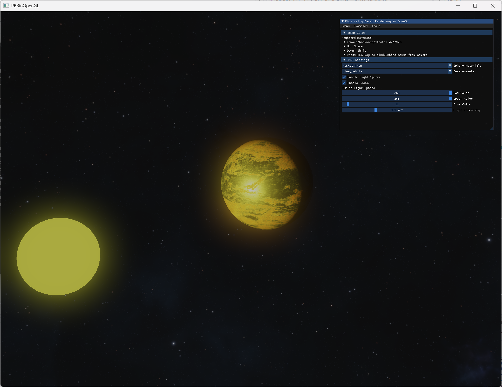
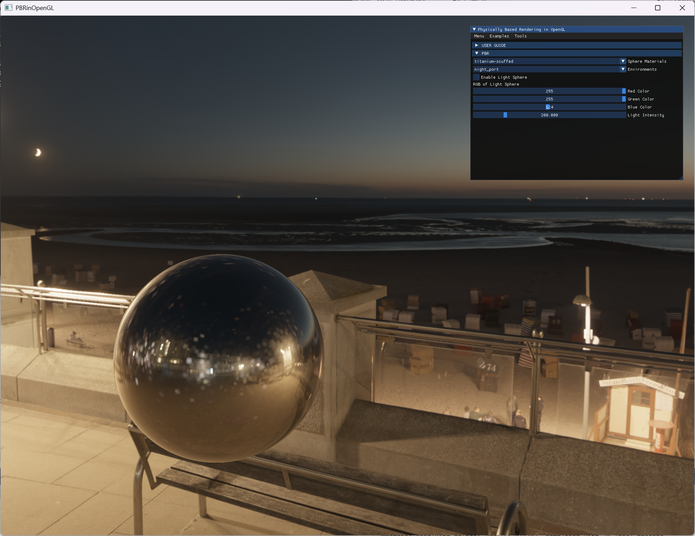

# Physically Based Rendering in OpenGL





Based off [LearnOpenGL](https://learnopengl.com/PBR/Theory) which is based off [Unreal 4 Engine's implementation of PBR](https://blog.selfshadow.com/publications/s2013-shading-course/karis/s2013_pbs_epic_notes_v2.pdf)

Includes a [UI](https://github.com/ocornut/imgui) to toggle things like materials and HDR maps.

## Getting started

1. Clone repo.
```
git clone --recurse-submodules https://github.com/steamedhams42/PhysicallyBasedRenderingInOpenGL.git
```
2. Compile with CMake and then run it! Piece of cake!

Tested and working on mingw64, ucrt64, g++, MSVC x64 compilers

## Remarks

* Uses [imgui version 1.83](https://github.com/ocornut/imgui/releases/tag/v1.83)
* Has only been tested on MingW64 compiler for Windows (so it may require some fixing for it to work for gcc or clang)

### Random notes to myself
The [rendering equation](https://en.wikipedia.org/wiki/Rendering_equation), also called the "light transport equation" in some literature:

$$L_o = \int_\Omega{f_r(\omega_o, \omega_i, n)L_i(p, \omega_i)n \cdot \omega_i d\omega_i}$$

Using [Lambertian](https://en.wikipedia.org/wiki/Lambertian_reflectance) and [Cook-Torrance](https://en.wikipedia.org/wiki/Specular_highlight#Cook%E2%80%93Torrance_model) for diffuse and specular reflection respectively where $k_d + k_s = 1$ and $c$ is the color:

$$L_o = \int_\Omega{(k_d\frac{c}{\pi} + k_s\frac{DFG}{4(\omega_o \cdot n)(\omega_i \cdot n)})L_i(p, \omega_i)n \cdot \omega_i d\omega_i}$$

By linearity:

$$L_o = k_d\frac{c}{\pi}\int_\Omega{L_i(p, \omega_i)n \cdot \omega_i d\omega_i} + k_s\int_\Omega\frac{DFG}{4(\omega_o \cdot n)(\omega_i \cdot n)}L_i(p, \omega_i)n \cdot \omega_i d\omega_i$$

In essence:

$$L_o = \int_\Omega{diffuse} + \int_\Omega{specular}$$

TODO: Write the split-sum approximation
